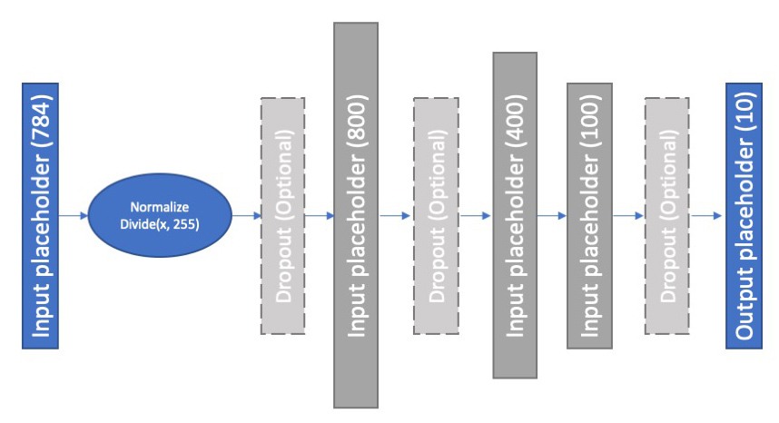
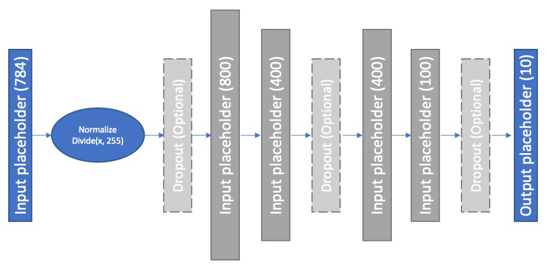

# fashion-mnist

Create 32 different model in a two possible architecture. In this experiment, we din't have permission to use the CNN's.

## Model Type 1
Dropouts are optionals and every model can have one dropout at most.
<p align="center">
  
</p>


## Model Type 2
Dropouts are optionals and every model can have one dropout at most.

<p align="center">
  
</p>

## Model Definition:

It includes four number. Please run 'model_id_gen.py' to get all the details of every model.


## Data:
Data already loaded as a numpy object and it's available in data folder. Please unzip file 'data.zip'.


## Visualization:
Please use `analysis/review.Rnw' file. It's a RStudio Sweave document.

# Getting Started

Please install libraries by running below command:
```
pip install -r requirements.txt
```

## Usage

```
main.py [-h] [--data_dir DATA_DIR] [--model_id MODEL_ID]

```
